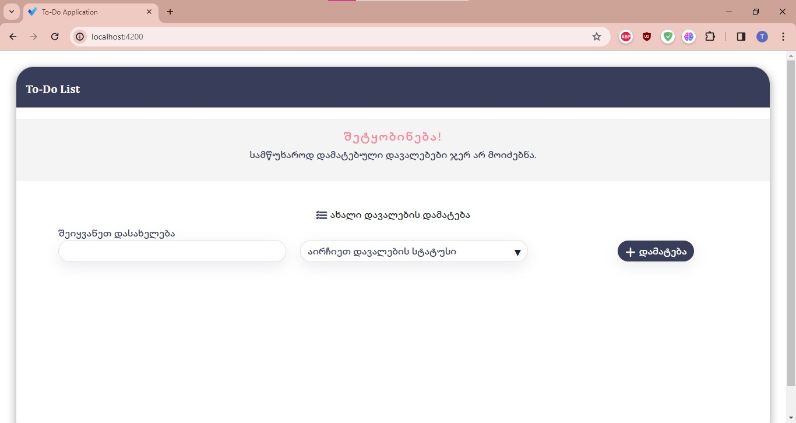
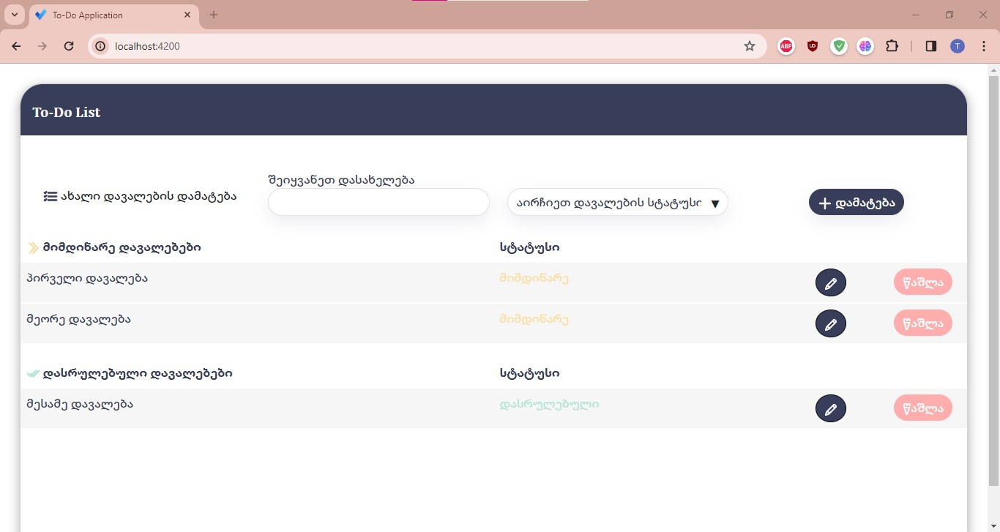

# To-Do List Application

This is a To-Do List application built with Angular for the frontend, ASP.NET for the backend, and MSSQL for the database. It allows users to add, get, update, and delete tasks.

## Features

- Add new tasks
- Update existing tasks
- Delete tasks
- Display a message when there are no tasks

## Frontend

The frontend is built with Angular. The main component is the `TaskListComponent`, which displays the list of tasks. If there are no tasks, it displays a message in Georgian saying "Unfortunately, no tasks have been added yet." There is also a form to add new tasks.

## Backend

The backend is built with ASP.NET. It provides API endpoints to add, get, update, and delete tasks.

## Database

The database is a Microsoft SQL Server (MSSQL) database. It stores the tasks. 
